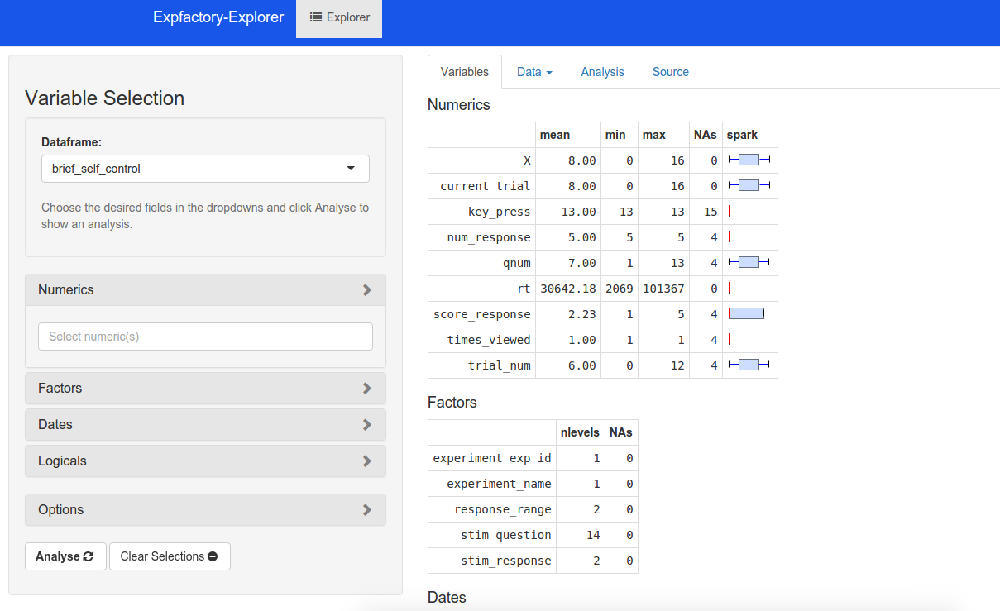

expfactory-explorer
==============

Shiny (www.rstudio.com/shiny) based data explorer with report templates based on field selection, customized for the experiment factory.

## Template Processing

All templates undergo (in order):
* gsub for mydf, numeric, factor1 etc
* brew
* knit2html

## Dependencies

* shiny >= 0.11 (bootstrap3)
* shinyAce
* tabplot
